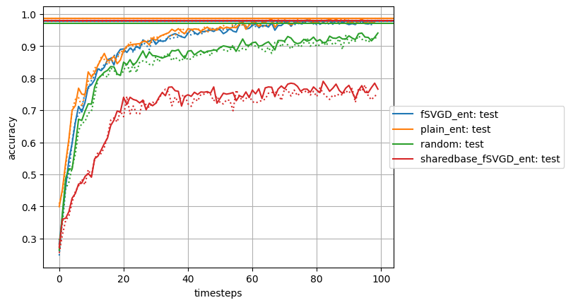

# SmalldataMNIST
A short experiment showcasing the use of ensembles with Stein variational gradient descent https://arxiv.org/abs/2106.11642 to quantify uncertainty in neural network classifiers, written in JAX/Haiku.

The models start with a large unlabeled data set, and a labeled data set of 10 samples. At each timestep, 10 labels are observed for the images the ensemble is currently most uncertain about. Uncertainty is quantified in several different ways for several different ensembling methods.
The results show that a network can match the performance of the full data set with only 1000 carefully chosen samples.

